# **CHATBOT APP (J.A.R.V.I.S BOT)**

**INTRODUCTION**

Over the last few years, Chatbots have played a prominent role as human-computer interfaces. Chatbots are generally composed of three modules: the user interface, an interpreter, and a knowledge base. Laven defines Chatbot as a program that attempts to simulate typed conversation, with the aim of at least temporarily fooling the human into thinking they were talking to another person. Basically, chatbot is a conversational agent that can interact with user in a given subject using the natural language. Many chatbots have been deployed on the internet for the purpose of education, customer service site, guidance, entertainment. Existing famous chatbots are ALICE.

SimSimi and Cleverbot. Artificial Intelligence Mark-up Language (AIML) is derived from extensible Mark-up language (XML) which is used to build up a conversational agent artificially. The AIML based chatbots are famous because they are light weighted, easy to configure as well as at minimum cost. AIML has class of data objects called AIML object which describes behaviour of computer programs.

The chatbots that have been deployed on the internet uses text, voice as well as sentiments as the input. In this project, we have used the text and voice as user input. Text I/O is relatively effective as user can review for the input so that it can be rechecked if there are any mistakes. However, giving text input consumes time. So, the solution is to introducing voice interface with the speech recognition technology. By these methods, this chatbot application is very able to make conversation with the user.

**LITERATURE SURVEY:**

Eliza is considered as the first chatbot which works on the pattern matching system. It is developed by Joseph Weizenbaum in 1964. ALICE is rule-based chatbot based on the Artificial Intelligence Markup Language (AIML). It has more than 40,000 categories, where each category has combination of pattern and its response.

Md.Shahriare Satu and Shamim-AI-Mamun showed the review of applications of the Chatbot which are developed using the AIML scripts. They said that AIML based chatbots are easy to implement, they are lightweight and efficient

to work. Their paper gives the detailed information about the different applications of the chatbots.

Thomas N. T. and Amrita Vishwa designed an AIML and LSA based chatbot to provide the customer care service over the E- commerce websites. Their approach shows we can improve the chatbot ability by adding other models to it.

In android operating system, we can implement the chatbot using the various approaches. One of the approaches is shown by Rushabh Jain and Burhanuddin Lokhandwala in their Android based Chat-Bot paper.

**Background Research:**

A chatbot is an AI agent that can participate in a conversation with a user. Most are equipped with a messenger type interface with an input from a user and an output from the chatbot. The chatbot processes the users input and outputs a reply based on what the user has just sent. It could be a greeting, conversation topic, or even an image.

Most basic chatbots work by matching a user input with a predefined set of dialogs. For example, a user saying, “Thank you” will result in the chatbot saying “You’re Welcome”. The predefined set of dialogs can be set up to imitate a normal conversation between two people. Problems can arise when a user says something the chatbot does not recognize, an example could be the user meaning to say, “Thank you”, but instead says “Thanks a lot”, this can confuse the chatbot as it will be looking to match the “Thank you” input with “Welcome”. This leads to a lot of manual work by trying to define every combination of a user saying “Thanks”.

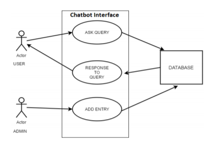  
Modern chatbots are more complex and feature natural language processing that can learn from user inputs. They can access APIs to get information users such as news, weather, time etc. They can even process orders and make bookings entirely through a chatbot interface.

**APPLICATIONS**

A chatbot can be used anywhere a human is interacting with a computer system. These are the areas where the fastest adoption is occurring:

**1) Customer Service —** A chatbot can be used as an “assistant” to a live agent, increasing the agent’s efficiency. When trained, they can also provide service when the call centre is closed, or eventually even act as an independent agent, if desired.

**2) Sales/Marketing/Branding —** Chatbots can be used for sales qualification, ecommerce, promotional campaigns, or as a branding vehicle.

**3) Human Resources —** An HR chatbot can help with frequently asked questions (“how many vacation days do I have left?”) and can act as an onboarding assistant.

**AIML (**ARTIFICIAL INTELLIGENCE MARKUP LANGUAGE)

If we go back a little bit, chatbots hadn’t always been this smart always. If we turn through the pages of history, we would come across Joseph Weizenbaum's program ELIZA, published in 1966. It seemed to be able to fool the humans into believing that it is a human. But Eliza was not intelligent. Its process involved the recognition of some cue phrases in the input, and the output response would already be pre-programmed to create a meaningful conversation. Thus, it was more of an illusion of understanding rather than a real understanding. ELIZA was followed by Parry in 1972 and Racter in 1983.

The next breakthrough was AIML chatbots, about which we are going to discuss in this article today. AIML or Artificial Intelligence Makeup Language enables people to input knowledge into chatbots based on the A.L.I.C.E free software technology, originally created by Richard Wallace. AIML was created in 1995 as an XML dialect which comes with all the good and bad that comes with XML. Let’s have a look at how AIML works.

## **Categories:**

The basic unit of knowledge in AIML is called category. A category consists of an input question or stimulus, and an output option called the template. The input question is also called the pattern. This is how a simple category looks

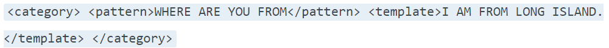

Here is the meaning of each tags used here:

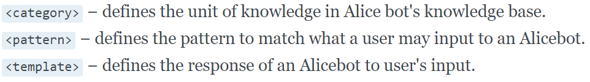

So, basically, your pattern is matched to a pre-programmed template and accordingly a response is delivered. The bot is not quite thinking on its own but simply matching to a large collection of data.

The AIML language is simple, it consists of words and wildcard characters, “\*” and “_” and is not case-sensitive.

## **Pattern (Input):**

Patterns is a series of letters/characters which are used to match the input to the output. For example, if the pattern is, “WHAT IS YOUR NAME?”, AIML will ignore the upper-case letter and will match to only one output.

Now if you give the input as “WHAT IS YOUR \*”, AIML will match it to a series of answers which can be anything, name, favourite colour etc.

## **Template:**

A template is a response to a matched pattern. In other words, it is the output which we get. An example of a simple text template - My name is John.

A template may use variables, such as the example

My address is \<bot name="address"/\> which will substitute the bot's address into the sentence

(Here the \<bot /\> (bot element) is used to recall custom bot properties defined in the. properties file. These variables are accessible to all users of the bot.) Template elements include basic text formatting, conditional response (if-then/else), and random responses.

E.g.:

\<aiml\>

\<topic name= “the topic” \>

\<category\>

\<pattern\>PATTERN\</pattern\>

\<that\>THAT\</that\>

\<template\>TEMPLATE\</template\>

\</category\>

\</topic\>

\</aiml\>

**2)**\<category\>

\<pattern\>YES\</pattern\>

\<that\>DO YOU LIKE MOVIES\</that\> \<template\>What is your favorite movie? \</template\>

\</category\>

-   **AIML Object**

    **1)**\<category\>

    \<pattern\>HELLO\</pattern\>

    \<template\>Hi there! \</template\>

    \</category\>

-   **Chat Sequence**

    User: Hello!

    Chat Bot: Hi There!

-   **AIML Object**

    **1)**\<category\>

    \<pattern\>HELLO\</pattern\>

    \<template\>Hi there! \</template\>

    \</category\>

-   **Chat Sequence**

    User: Hello!

    Chat Bot: Hi There!

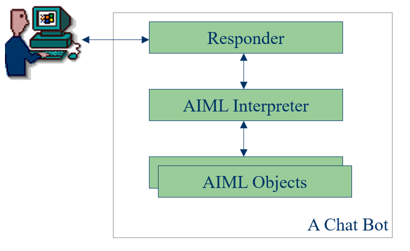**Architecture of a Chat Bot**

**SPEECH-TO-TEXT**

Speech-recognition is the inter-disciplinary sub-field of computational linguistics that develops methodologies and technologies that enables the recognition and [translation](https://en.wikipedia.org/wiki/Translation) of spoken language into text by computers. It is also known as **automatic speech recognition (ASR)**, **computer speech recognition or speech to text (STT)**.It incorporates knowledge and research in the [linguistics](https://en.wikipedia.org/wiki/Linguistics), [computer science](https://en.wikipedia.org/wiki/Computer_science), and [electrical engineering](https://en.wikipedia.org/wiki/Electrical_engineering) fields.

Some speech recognition systems require "training" where an individual speaker reads text or isolated [vocabulary](https://en.wikipedia.org/wiki/Vocabulary) into the system. The system analyses the person's specific voice and uses it to fine-tune the recognition of that person's speech, resulting in increased accuracy. Systems that do not use training are called "speaker independent"[[1]](https://en.wikipedia.org/wiki/Speech_recognition#cite_note-1) systems. Systems that use training are called "speaker dependent".

Speech recognition applications include [voice user interfaces](https://en.wikipedia.org/wiki/Voice_user_interface) such as voice dialing (e.g. "call home"), call routing (e.g. "I would like to make a collect call"), [domotic](https://en.wikipedia.org/wiki/Domotic) appliance control, search (e.g. find a podcast where particular words were spoken), simple data entry (e.g., entering a credit card number), preparation of structured documents (e.g. a radiology report), determining

The term voice recognition or [speaker identification](https://en.wikipedia.org/wiki/Speaker_recognition) refers to identifying the speaker, rather than what they are saying. [Recognizing the speaker](https://en.wikipedia.org/wiki/Speaker_recognition) can simplify the task of translating speech in systems that have been trained on a specific person's voice or it can be used to authenticate or verify the identity of a speaker as part of a security process. speaker characteristics, speech-to-text processing (e.g., word processors or emails), and aircraft (usually termed direct voice input).

From the technology perspective, speech recognition has a long history with several waves of major innovations. Most recently, the field has benefited from advances in [deep learning](https://en.wikipedia.org/wiki/Deep_learning) and [big data](https://en.wikipedia.org/wiki/Big_data). The advances are evidenced not only by the surge of academic papers published in the field, but more importantly by the worldwide industry adoption of a variety of deep learning methods in designing and deploying speech recognition systems.

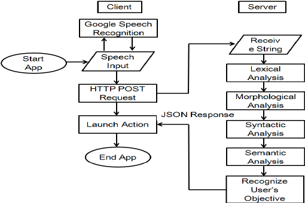

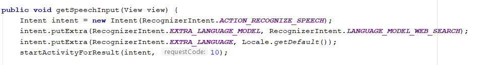Sample Code for getting speech:

**Sample code:**

**package** com.abhijeetofspades.chatbot;  
  
**import** java.io.InputStream;  
**import** java.io.UnsupportedEncodingException;  
**import** java.net.URLEncoder;  
**import** java.util.ArrayList;  
  
**import** android.content.ActivityNotFoundException;  
**import** android.content.Context;  
**import** android.content.Intent;  
**import** android.content.res.AssetManager;  
**import** android.net.Uri;  
**import** android.os.Environment;  
**import** android.speech.RecognizerIntent;  
**import** android.support.design.widget.FloatingActionButton;  
**import** android.support.design.widget.TextInputEditText;  
**import** android.support.v7.app.AppCompatActivity;  
**import** android.os.Bundle;  
**import** android.text.TextUtils;  
**import** android.view.KeyEvent;  
**import** android.view.View;  
**import** android.view.inputmethod.InputMethodManager;  
**import** android.widget.EditText;  
**import** android.widget.ImageView;  
**import** android.widget.ListView;  
**import** android.widget.TextView;  
  
**import** org.alicebot.ab.AIMLProcessor;  
**import** org.alicebot.ab.Bot;  
**import** org.alicebot.ab.Chat;  
**import** org.alicebot.ab.Graphmaster;  
**import** org.alicebot.ab.MagicBooleans;  
**import** org.alicebot.ab.MagicStrings;  
**import** org.alicebot.ab.PCAIMLProcessorExtension;  
**import** org.alicebot.ab.Timer;  
**import** com.abhijeetofspades.chatbot.Adapter.ChatMessageAdapter;  
**import** com.abhijeetofspades.chatbot.Pojo.ChatMessage;  
  
**import** java.io.File;  
**import** java.io.FileOutputStream;  
**import** java.io.IOException;  
**import** java.io.InputStream;  
**import** java.io.OutputStream;  
**import** java.util.ArrayList;  
**import** java.util.Locale;  
  
**public class** MainActivity **extends** AppCompatActivity {  
  
 **private** ListView **mListView**;  
 **private** FloatingActionButton **mButtonSend**;  
 **private** EditText **txvResult**;  
 **private** ImageView **mImageView**;  
 **public** Bot **bot**;  
 **public static** Chat *chat*;  
 **private** ChatMessageAdapter **mAdapter**;  
 **private** EditText **query**;  
 **private** EditText **escapedQuery**;  
  
 @Override  
 **protected void** onCreate(Bundle savedInstanceState) {  
 **super**.onCreate(savedInstanceState);  
 setContentView(R.layout.**activity_main**);  
 **mListView** = (ListView) findViewById(R.id.**listView**);  
 **mButtonSend** = (FloatingActionButton) findViewById(R.id.**btn_send**);  
 **txvResult** = (EditText) findViewById(R.id.**txvResult**);  
 **mImageView** = (ImageView) findViewById(R.id.**iv_image**);  
 **mAdapter** = **new** ChatMessageAdapter(**this**, **new** ArrayList\<ChatMessage\>());  
 **mListView**.setAdapter(**mAdapter**);  
 **mButtonSend**.setOnClickListener(**new** View.OnClickListener() {  
 @Override  
 **public void** onClick(View v) {  
 String message = **txvResult**.getText().toString();  
 *//startActivity(new Intent(Intent.ACTION_VIEW, Uri.parse("https://www.google.com/search?q="+message)));  
  
 //bot  
* String response = *chat*.multisentenceRespond(**txvResult**.getText().toString());  
 **if** (TextUtils.*isEmpty*(message)) {  
 **return**;  
 }  
 sendMessage(message);  
 mimicOtherMessage(response);  
 **txvResult**.setText(**""**);  
 **mListView**.setSelection(**mAdapter**.getCount() - 1);  
 }  
 });  
 *//checking SD card availablility  
* **boolean** a = *isSDCARDAvailable*();  
 *//receiving the assets from the app directory  
* AssetManager assets = getResources().getAssets();  
 File jayDir = **new** File(Environment.*getExternalStorageDirectory*().toString() + **"/abhijeet/bots/Abhijeet"**);  
 **boolean** b = jayDir.mkdirs();  
 **if** (jayDir.exists()) {  
 *//Reading the file  
* **try** {  
 **for** (String dir : assets.list(**"Abhijeet"**)) {  
 File subdir = **new** File(jayDir.getPath() + **"/"** + dir);  
 **boolean** subdir_check = subdir.mkdirs();  
 **for** (String file : assets.list(**"Abhijeet/"** + dir)) {  
 File f = **new** File(jayDir.getPath() + **"/"** + dir + **"/"** + file);  
 **if** (f.exists()) {  
 **continue**;  
 }  
 InputStream in = **null**;  
 OutputStream out = **null**;  
 in = assets.open(**"Abhijeet/"** + dir + **"/"** + file);  
 out = **new** FileOutputStream(jayDir.getPath() + **"/"** + dir + **"/"** + file);  
 *//copy file from assets to the mobile's SD card or any secondary memory  
* copyFile(in, out);  
 in.close();  
 in = **null**;  
 out.flush();  
 out.close();  
 out = **null**;  
 }  
 }  
 } **catch** (IOException e) {  
 e.printStackTrace();  
 }  
 }  
 *//get the working directory  
* MagicStrings.*root_path* = Environment.*getExternalStorageDirectory*().toString() + **"/abhijeet"**;  
 System.**out**.println(**"Working Directory = "** + MagicStrings.*root_path*);  
 AIMLProcessor.*extension* = **new** PCAIMLProcessorExtension();  
 *//Assign the AIML files to bot for processing  
* **bot** = **new** Bot(**"Abhijeet"**, MagicStrings.*root_path*, **"chat"**);  
 *chat* = **new** Chat(**bot**);  
 String[] args = **null**;  
 *mainFunction*(args);  
  
 }  
  
 **public void** getSpeechInput(View view) {  
 Intent intent = **new** Intent(RecognizerIntent.**ACTION_RECOGNIZE_SPEECH**);  
 intent.putExtra(RecognizerIntent.**EXTRA_LANGUAGE_MODEL**, RecognizerIntent.**LANGUAGE_MODEL_WEB_SEARCH**);  
 intent.putExtra(RecognizerIntent.**EXTRA_LANGUAGE**, Locale.*getDefault*());  
 startActivityForResult(intent, 10);  
  
 }  
  
 @Override  
 **protected void** onActivityResult(**int** requestCode, **int** resultCode, Intent data) {  
 **super**.onActivityResult(requestCode, resultCode, data);  
  
 **switch** (requestCode) {  
 **case** 10:  
 **if** (resultCode == **RESULT_OK** && data != **null**) {  
 ArrayList\<String\> result = data.getStringArrayListExtra(RecognizerIntent.**EXTRA_RESULTS**);  
 **txvResult**.setText(result.get(0));  
 }  
 **break**;  
 }  
 }  
  
 **private void** sendMessage(String message) {  
 ChatMessage chatMessage = **new** ChatMessage(message, **true**, **false**);  
 **mAdapter**.add(chatMessage);  
  
  
 *//mimicOtherMessage(message);  
* }  
  
 **private void** mimicOtherMessage(String message) {  
 ChatMessage chatMessage = **new** ChatMessage(message, **false**, **false**);  
 **mAdapter**.add(chatMessage);  
 }  
  
 **private void** sendMessage() {  
 ChatMessage chatMessage = **new** ChatMessage(**null**, **true**, **true**);  
 **mAdapter**.add(chatMessage);  
  
 mimicOtherMessage();  
 }  
  
 **private void** mimicOtherMessage() {  
 ChatMessage chatMessage = **new** ChatMessage(**null**, **false**, **true**);  
 **mAdapter**.add(chatMessage);  
 }  
  
 *//check SD card availability  
* **public static boolean** isSDCARDAvailable() {  
 **return** Environment.*getExternalStorageState*().equals(Environment.**MEDIA_MOUNTED**) ? **true** : **false**;  
 }  
  
 *//copying the file  
* **private void** copyFile(InputStream in, OutputStream out) **throws** IOException {  
 **byte**[] buffer = **new byte**[1024];  
 **int** read;  
 **while** ((read = in.read(buffer)) != -1) {  
 out.write(buffer, 0, read);  
 }  
 }  
  
 *//Request and response of user and the bot  
* **public static void** mainFunction(String[] args) {  
 MagicBooleans.*trace_mode* = **false**;  
 System.**out**.println(**"trace mode = "** + MagicBooleans.*trace_mode*);  
 Graphmaster.*enableShortCuts* = **true**;  
 Timer timer = **new** Timer();  
 String request = **"Hello."**;  
 String response = *chat*.multisentenceRespond(request);  
  
 System.**out**.println(**"Human: "** + request);  
 System.**out**.println(**"Robot: "** + response);  
  
 }  
  
}

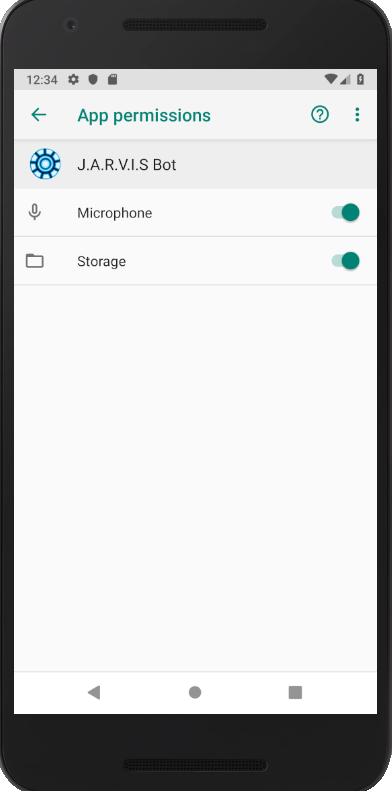 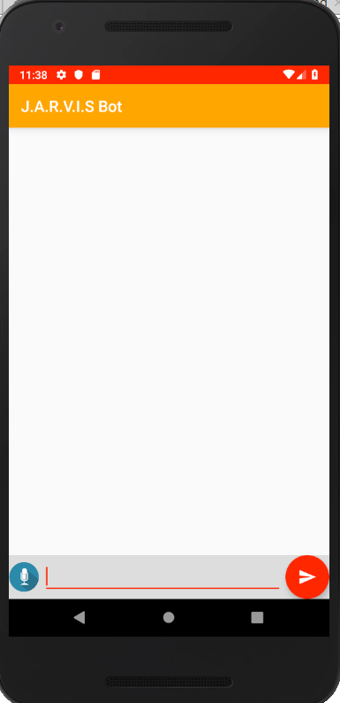

**SCREENSHOTS OF APP:**

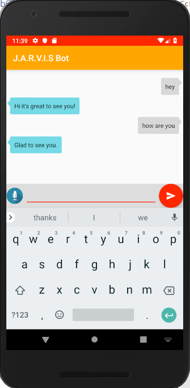
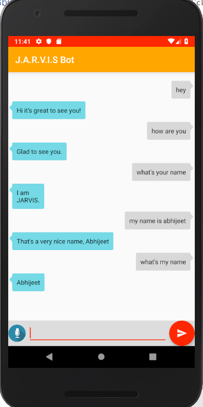
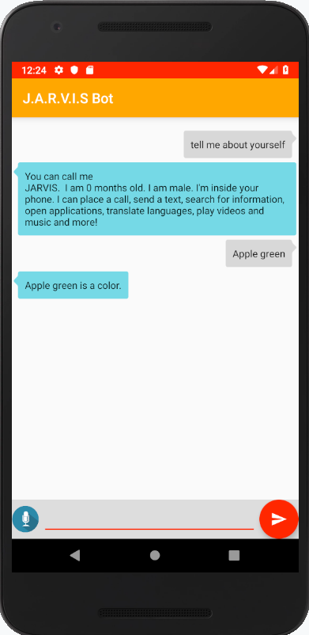
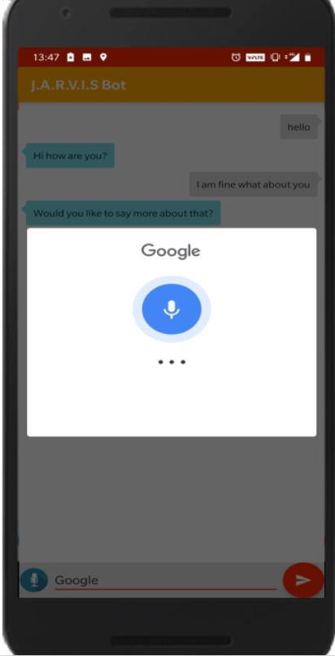
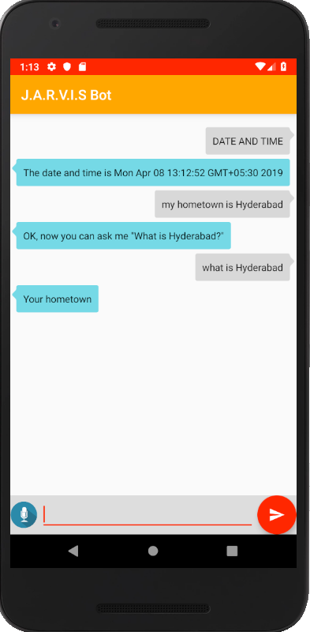
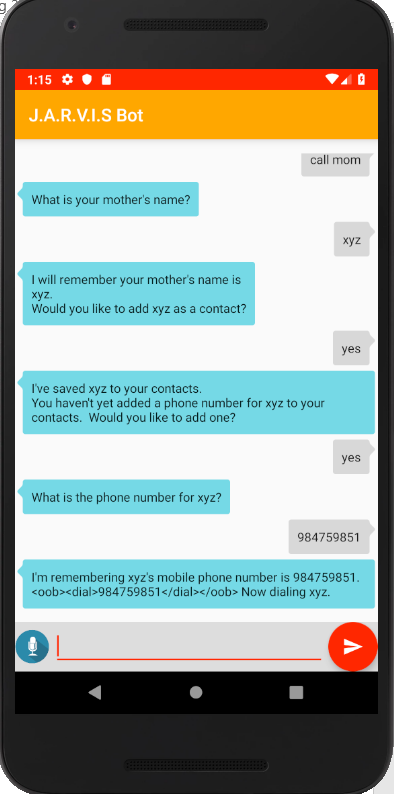
